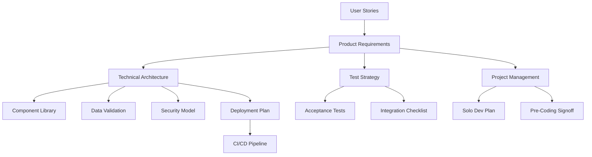

# Jídelníček Project Documentation Index

This index provides a complete overview of all project documentation after cleanup, organized by category. Each document serves a specific purpose in the development lifecycle.

## 1. Core Requirements

### Product Requirements
- **[[jidelnicek_US]]** - User Stories defining all functional requirements from user perspective
  - *Purpose*: Captures what users need to accomplish with the application
  
- **[[jidelnicek_PRD]]** - Product Requirements Document with detailed specifications
  - *Purpose*: Comprehensive product vision, scope, and technical requirements

## 2. Technical Documentation

### Architecture & Design
- **[[jidelnicek_Technical Architecture]]** - System architecture and technology stack
  - *Purpose*: Defines technical structure, frameworks, and integration patterns
  
- **[[jidelnicek_Component Library]]** - Reusable UI component specifications
  - *Purpose*: Ensures consistent UI/UX across the application

### Data & Validation
- **[[jidelnicek_Data Validation Rules]]** - Input validation and business rules
  - *Purpose*: Defines data integrity constraints and validation logic
  
- **[[jidelnicek_Reference Data]]** - Ingredient categories and common items
  - *Purpose*: Provides standardized data for auto-completion and categorization

### API & Security
- **[[jidelnicek_OpenAPI Spec]]** - Complete REST API specification
  - *Purpose*: Defines all API endpoints, request/response formats, and schemas

- **[[jidelnicek_Security Threat Model]]** - Security analysis and mitigation strategies
  - *Purpose*: Identifies potential security risks and defines protective measures

## 3. Testing Documentation

### Test Strategy
- **[[jidelnicek_Test Strategy]]** - Overall testing approach and methodology
  - *Purpose*: Defines testing levels, tools, and quality criteria

### Test Cases
- **[[jidelnicek_Acceptance Tests]]** - User acceptance test scenarios
  - *Purpose*: Validates that features meet user requirements

### Review Processes
- **[[jidelnicek_Integration Review Checklist]]** - Pre-deployment verification
  - *Purpose*: Ensures all components work together correctly

## 4. Deployment Documentation

### Deployment Guide
- **[[jidelnicek_Deployment Plan - vpsFree]]** - Complete vpsFree deployment guide
  - *Purpose*: Comprehensive deployment instructions, configurations, and maintenance procedures

### CI/CD
- **[[jidelnicek_CI-CD Pipeline]]** - Continuous integration and deployment setup
  - *Purpose*: Automates testing and deployment processes

## 5. Project Management

### Development Planning
- **[[jidelnicek_Solo Developer Plan]]** - Realistic solo development approach
  - *Purpose*: Phased implementation plan for individual developer
  

### Project Coordination
- **[[jidelnicek_Project Management]]** - Overall project coordination approach
  - *Purpose*: Defines workflows, tools, and communication patterns

### Milestone Documentation
- **[[jidelnicek_Pre-Coding Sign-off]]** - Requirements approval checkpoint
  - *Purpose*: Ensures all planning is complete before development starts

## 6. User Documentation

- **[[jidelnicek_User Documentation Plan]]** - Documentation strategy for end users
  - *Purpose*: Outlines help content and user guidance materials

## 7. Project Overview

- **[[README]]** - Project introduction and quick start guide
  - *Purpose*: Entry point for new developers and stakeholders

---

## Document Relationships

## Usage Guide

1. **Starting Development**: Begin with US → PRD → Technical Architecture
2. **Implementation**: Reference Component Library, Data Validation, and Security Model
3. **Testing**: Follow Test Strategy, execute Acceptance Tests
4. **Deployment**: Use vpsFree Deployment Plan with CI/CD Pipeline
5. **Project Tracking**: Refer to Solo Developer Plan for phasing

This clean documentation structure provides everything needed for successful project execution while avoiding redundancy and maintaining clarity.